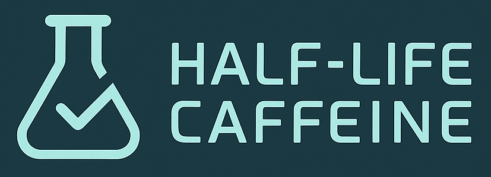
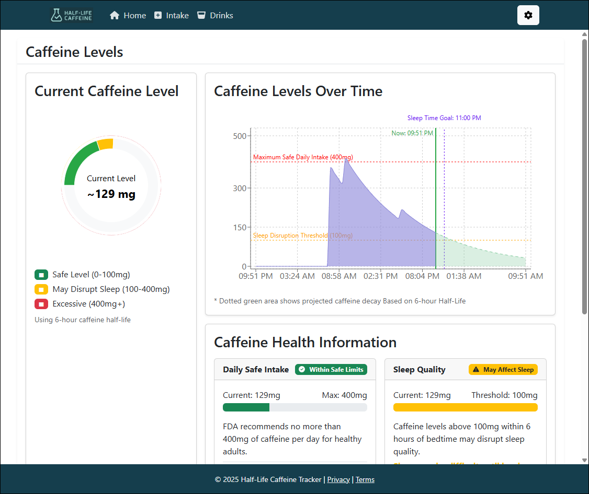

# Half-Life Caffeine Tracker

A web application that helps you track and visualize caffeine levels in your body over time, based on the half-life decay principle.

[](https://github.com/halflifecaffeine/halflifecaffeine.github.io/actions/workflows/deploy.yml)



## About the Project

Half-Life Caffeine Tracker is a single-purpose static web application that helps you visualize the degradation (half-life) of caffeine in your body over time. The app uses a scientifically-backed caffeine metabolism model to show you your current and projected caffeine levels.

### Key Features

- **Caffeine Intake Tracking**: Log your caffeine consumption with precise timestamps
- **Visualization**: See your caffeine levels on an interactive chart with projections
- **Drink Database**: Access a comprehensive database of common caffeinated beverages
- **Personalization**: Customize metabolism settings based on your biology
- **Offline Support**: Works without internet as a Progressive Web App (PWA)
- **Privacy-Focused**: All data stored locally in your browser - no server tracking



## Getting Started

### Prerequisites

- [Node.js](https://nodejs.org/) (v18.0.0 or higher)
- [npm](https://www.npmjs.com/) (v7.0.0 or higher) or [yarn](https://yarnpkg.com/)
- A modern web browser

### Installation

1. Clone the repository

```bash
git clone https://github.com/halflifecaffeine/halflifecaffeine.github.io.git
cd halflifecaffeine.github.io
```

2. Install the dependencies

```bash
cd src
npm install
```

> [!NOTE]
> If you prefer yarn, you can run `yarn install` instead.

### Running Locally

Start the development server:

```bash
npm run dev
```

This will start the Vite development server, typically at [http://localhost:5173](http://localhost:5173).

> [!TIP]
> Use the `--host` flag to make the app accessible from other devices on your network:
> ```bash
> npm run dev -- --host
> ```

### Building for Production

```bash
npm run build
```

This will generate optimized production files in the `dist` directory.

To preview the production build locally:

```bash
npm run preview
```

## Platform-Specific Notes

### Windows

- Use PowerShell or Git Bash for the best experience with the commands above
- If you encounter EACCES permissions errors, run your terminal as Administrator

### macOS/Linux

- No special considerations, all commands should work as expected
- If you encounter permission issues, you might need to use `sudo` for npm global installations

> [!IMPORTANT]
> When running locally on macOS or Linux, make sure file paths maintain correct case sensitivity for imports.

## Contributing

Contributions are welcome! Please feel free to submit a Pull Request.

1. Fork the project
2. Create your feature branch (`git checkout -b feature/amazing-feature`)
3. Commit your changes (`git commit -m 'Add some amazing feature'`)
4. Push to the branch (`git push origin feature/amazing-feature`)
5. Open a Pull Request

## License

This project is licensed under the MIT License - see the [LICENSE](LICENSE) file for details.

## Acknowledgments

- Built with [React](https://reactjs.org/), [TypeScript](https://www.typescriptlang.org/), and [Vite](https://vitejs.dev/)
- UI components from [React Bootstrap](https://react-bootstrap.github.io/)
- Charts powered by [Recharts](https://recharts.org/)
